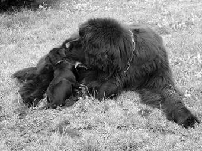
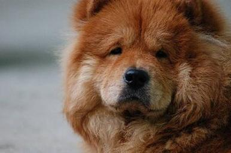
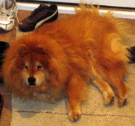

# Deep Learning Assignment 2
NCKU 112 Spring - Deep Learning Assignment 2 by Prof. Chih-Chung Hsu
## Setup
- Clone the repository
```bash
git clone https://github.com/LittleFish-Coder/deep-learning-assignment-2.git
```
- Setup virtual environment (Python 3.11)
```bash
conda create -n dl2 python=3.11
conda activate dl2
```
- Install packages: 
```bash
pip install -r requirements.txt
```
- Download Dataset: [Mini-ImageNet](https://cchsu.info/files/images.zip)

    run the command below to download the dataset
```bash
bash scripts/download_dataset.sh
```

## Data Preprocessing
In our dataset, there contains 50 classes, each class has multiple images. 
### Sample images from the dataset:
|n02111277_1207.JPEG|n02112137_7.JPEG|n02112137_112.JPEG|
|---|---|---|
||||

It's worth noting that each image does not have the same size, so we need to standardize the size of all images. Moreover, some images are in RGB format, while others are in grayscale format.
- Image Size: we resize all images to **256x256** pixels.
- Image Channel: we convert all images to **RGB format(3 channels)**.

## Report

