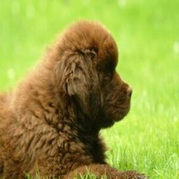
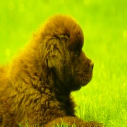
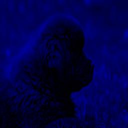
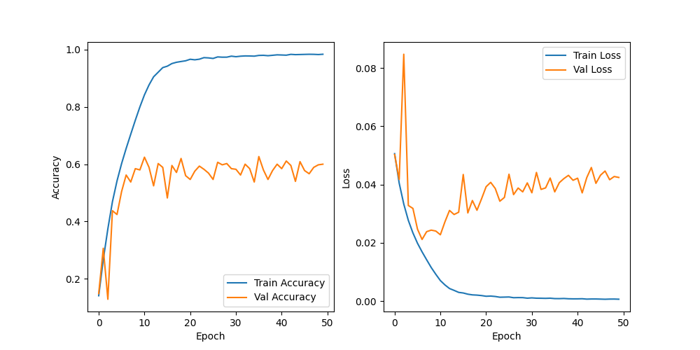

# Deep Learning Assignment 2
NCKU 112 Spring - Deep Learning Assignment 2 by Prof. Chih-Chung Hsu

📝 You can check the report [here](./document/report.pdf)!

## Setup
- Clone the repository
```bash
git clone https://github.com/LittleFish-Coder/deep-learning-assignment-2.git

cd deep-learning-assignment-2
```
- Setup virtual environment (Python 3.10)
```bash
conda create -n dl2 python=3.10
conda activate dl2
```
- Install packages: 
```bash
pip install -r requirements.txt
```
- Download Dataset: [Mini-ImageNet](https://cchsu.info/files/images.zip)

    run the command below to download the dataset
```bash
bash scripts/download_dataset.sh
```

- Train the model
```bash
python train.py --task $TASK
```

task: [task1_CNN, task1_dynamic, task2_ResNet34, task2_attention]

- Test the model (pretrained weights are given) 
```bash
python test.py --task $TASK --channels $CHANNELS
```
task: [task1_CNN, task1_dynamic, task2_ResNet34, task2_attention]

channels: [RGB, RG, GB, R, G, B]

## Dataset
Mini-ImageNet is a subset of the ImageNet dataset, which contains 50 classes.
- Training Set: 63325
- Validation Set: 450
- Testing Set: 450

### Sample images from the dataset:
|n02111277_1207.JPEG|n02112137_7.JPEG|n02112137_112.JPEG|
|---|---|---|
||||

### Data Preprocessing 
It's worth noting that each image does not have the same size, so we need to standardize the size of all images. Moreover, some images are in RGB format, while others are in grayscale format.
- Image Size: we resize all images to **256x256** pixels.
- Image Channel: we convert all images to **RGB format(3 channels)**.

## Task I: Designing a Convolution Module for Variable Input Channels

### SimpleCNN

The model consists of three convolutional layers, each followed by a batch normalization layer and a max-pooling layer. The output of the last max-pooling layer is fed into a fully connected layer with 256 neurons, followed by a dropout layer and a fully connected layer with 50 neurons.

#### Validation Accuracy & Loss
We save the best model based on the validation loss.
- Best Validation Accuracy: 0.3379
- Best Validation Loss: 0.0349


#### Testing Accuracy & Loss
We test the model with different combinations of input channels. The results are shown below:
||RGB|RG|GB|R|G|B|
|---|---|---|---|---|---|---|
|Accuracy|0.3556|0.3111|0.0378|0.0222|0.0222|0.02|
|Loss|0.0412|0.0479|0.1202|0.2145|0.1152|0.2187|

#### Test Dataset Design
We will test the model on 6 downstream tasks, each using different combinations of the RGB channels.

Since the simple CNN can only process images with 3 channels, we have redesigned the test dataset to accommodate this limitation. When testing different channel combinations, we will first select the desired channels and then copy these channels to a new image. The channels that are not selected will be padded with zeros. This ensures that the image remains in a 3-channel format.

For example, if the 'RG' combination is selected, we will copy the 'R' and 'G' channels from the raw image. The 'B' channel will be set to zero.

Below are samples for images with each selected channel combination:
|RGB|RG|GB|
|---|---|---|
||||

|R|G|B|
|---|---|---|
||||

### DynamicCNN

We use the SimpleCNN model as the backbone model and add a `PoolChannelAttention` module at the beginning of the model. 

The `PoolChannelAttention` can dynamically adjust the weights of the input channels. 
#### Validation Accuracy & Loss
We save the best model based on the validation loss.
- Best Validation Accuracy: 0.2889
- Best Validation Loss: 0.0410


#### Testing Accuracy & Loss
We test the model with different combinations of input channels. The results are shown below:

||RGB|RG|GB|R|G|B|
|---|---|---|---|---|---|---|
|Accuracy|0.3044|0.3111|0.2911|0.3089|0.3089|0.2467|
|Loss|0.0480|0.0479|0.0483|0.0489|0.0478|0.0526|

#### Test Dataset Design
The Dynamic CNN can handle different input channels. Therefore, if 'RG' is selected for testing, we will create a new image containing only the 'RG' channel information from the raw image.

In this way, we can create images with the following dimensions:
-	(1, height, width) for 'R', 'G', or 'B'
-	(2, height, width) for 'RG' or 'GB'
-	(3, height, width) for 'RGB'


## Task II: Designing a Two-Layer Network for Image Classification

### ResNet34
#### Validation Accuracy & Loss
We save the best model based on the validation loss.
- Best Validation Accuracy: 0.5622
- Best Validation Loss: 0.0212


#### Testing Accuracy & Loss
- Testing Accuracy: 0.5978
- Testing Loss: 0.0221


### Attention CNN
#### Validation Accuracy & Loss
We save the best model based on the validation loss.
- Best Validation Accuracy: 0.5222
- Best Validation Loss: 0.0235


#### Testing Accuracy & Loss
- Testing Accuracy: 0.5911
- Testing Loss: 0.0239

### Comparison
By adding a Spatial Attention module to a simple CNN with some residual blocks, we are able to rival the ResNet34 model.

||ResNet34|Attention CNN|
|---|---|---|
|Test Accuracy|0.5978|0.5911|
|Test Loss|0.0221|0.0239|
|Total params|21,310,322|446,868|


